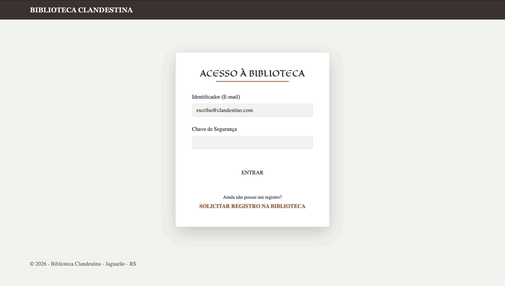

# Biblioteca Clandestina




> Sistema de gestão de acervos e empréstimos desenvolvido em ASP.NET Core MVC. O projeto automatiza processos manuais de bibliotecas, garantindo integridade de dados e facilidade de manutenção através de uma arquitetura robusta.

### 🛠 Tecnologias e Ferramentas
**Linguagem**: C#

**Framework** **Web**: ASP.NET Core MVC (Model-View-Controller), Bootstrap 5

**Interface**: Razor Pages (HTML5, CSS3, JavaScript)

**ORM**: Entity Framework Core

**Padrões de Projeto**: Repository Pattern e Injeção de Dependência (DI)

**Ambiente de Desenvolvimento**: JetBrains Rider no macOS

### Ajustes e melhorias

O projeto ainda está em desenvolvimento e as próximas atualizações serão voltadas para as seguintes tarefas:

- [x] Configuração da arquitetura MVC e Entity Framework Core
- [x] Implementação do Repository Pattern e Injeção de Dependência
- [x] Desenvolvimento das Views Razor para CRUD de Livros
- [ ] Sistema de relatórios de empréstimos atrasados

## 💻 Pré-requisitos

Antes de começar, verifique se você atendeu aos seguintes requisitos:

- Você instalou o `.NET SDK 8.0` (ou superior)
- Você tem uma máquina `Mac`, `Linux` ou `Windows`. (Desenvolvido e testado no macOS via JetBrains Rider).
- Você possui uma instância de SQL Server ou banco de dados configurado no `appsettings.json`.

## 🚀 Instalando JagLib

Para instalar o JagLib, siga estas etapas:

Linux e macOS:

```
git clone https://github.com/alejandro-s23/biblioteca-clandestina.git
cd biblioteca-clandestina
dotnet restore
```

Windows:

```
git clone https://github.com/alejandro-s23/biblioteca-clandestina.git
cd biblioteca-clandestina
dotnet restore
```

## ☕ Usando o aplicativo

Para utilizar o software, siga estas etapas:

1- Entre na pasta do projeto Library

```bash
cd Library
```

2- Atualize o banco de dados via Entity Framework

```bash
dotnet ef database update
```

3- Execute a aplicação

```bash
dotnet run
```

4- Acesse `http://localhost:5000` (ou a porta indicada no console) no seu navegador para visualizar a interface.


## 📫 Contribuindo para Biblioteca Clandestina

Para contribuir com Biblioteca Clandestina, siga estas etapas:

1. Bifurque este repositório.
2. Crie um branch: `git checkout -b <nome_branch>`.
3. Faça suas alterações e confirme-as: `git commit -m '<mensagem_commit>'`
4. Envie para o branch original: `git push origin <nome_do_projeto> / <local>`
5. Crie a solicitação de pull.

Como alternativa, consulte a documentação do GitHub em [como criar uma solicitação pull](https://help.github.com/en/github/collaborating-with-issues-and-pull-requests/creating-a-pull-request).

## 🤝 Colaboradores

Agradecemos às seguintes pessoas que contribuíram para este projeto:

<table>
  <tr>
    <td align="center">
      <a href="#" title="foto-alejandro-s23">
        <br>
        <sub>
          <b>Alejandro Souza</b>
        </sub>
      </a>
    </td>
  </tr>
</table>

## 📝 Licença

Esse projeto está sob licença. Veja o arquivo [LICENÇA](LICENSE) para mais detalhes.
